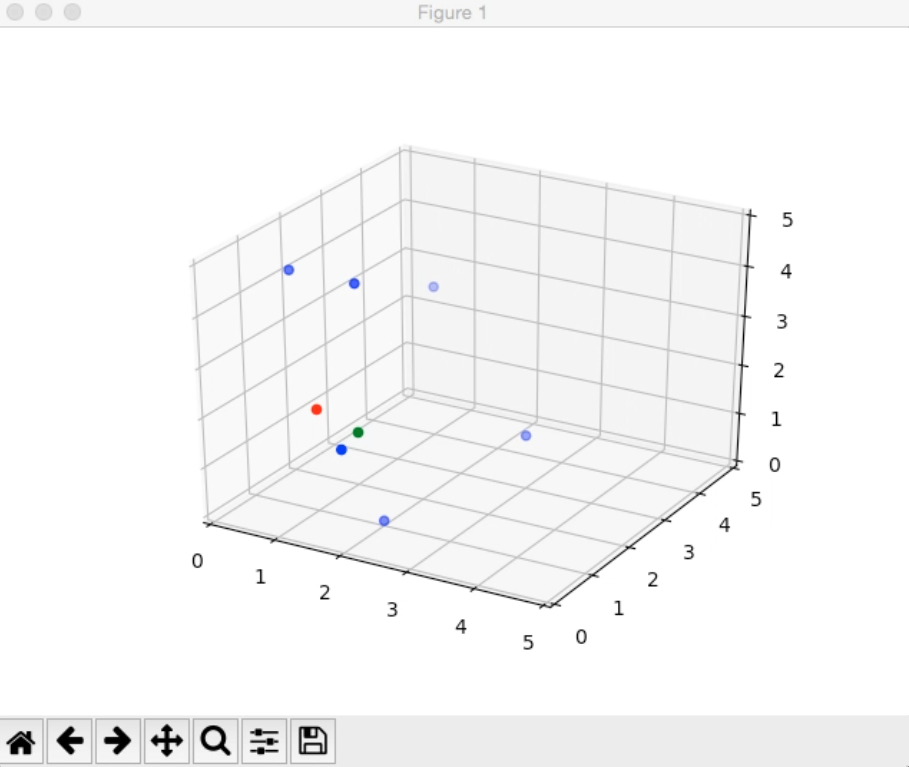

# Wonkavator
Simulation of an elevator program with matplotlib library

Wonkavator is like an elevator, but an elevator can only go up and down. A Wonkavator can go sideways, and slantways, and longways, and backways, amongst other things. In fact, it can take you to any room in an entire

## Sample Output

A blue dot for each person not yet in the elevator / not yet arrived at their destination
A red dot for the destinations of the people currently in the elevator
A green dot for the elevator itself

This program is a simulation of a building in which the Wonkavator will move around. The building will be represented by a 3D grid, where each coordinate in the grid represents a room. The Wonkavator can travel from room to room by moving at most 1 unit in any direction. For example, it could move from point (2, 3, 4) to point (2, 4, 5), by making a movement of (0, 1, 1). However, it is illegal to make a move from (1, 1, 1) to (3, 1, 1), as we can move a maximum of 1, not 2, in any direction. A move of (0, 0, 0) (i.e., staying in place) is also invalid. Further, it is invalid to move beyond the bounds of the grid (i.e., out of the building). If the Wonkavator is at coordinate (5, 5, 4), and the grid is of size 6x6x6, then it is invalid to move in the direction (1, 0, 0), as that would bring the Wonkavator out of the grid.

The Person class defines a person inside the building. At the start of the simulation, each Person will be located at one particular (x, y, z) coordinate in the grid. The Person class contains four attributes: the person's name, their current position in the grid (represented as a Point3D object), their destination position in the grid (represented as a Point3D object), and Finally a boolean variable indicating whether or not they have arrived at their destination yet

The Wonkavator class contains methods to move the Wonkavator and maintain the list of people currently inside. The Wonkavator must travel to each person's (x, y, z) coordinate, moving by at most 1 in any dimension at a time. After picking up a person, it must deliver them to their destination (x, y, z) coordinate. The Wonkavator doesn't have to deliver a
person right after picking them up; it could pick up multiple people before delivering all of them to their destinations. Once a person has reached their destination, they remain there for the rest of the simulation. The Wonkavator class contains three attributes: its current position in the grid (represented as a Point3D object), the size of the factory (represented as a Point3D object), and a list of the people currently in the Wonkavator.

The Factory class contains methods to run the simulation and display it to the screen. It also contains four attributes: the size of the factory (a Point3D object), a list of the people in the simulation (i.e., a list of Person objects), one object of type Wonkavator for the actual elevator, and Finally an attribute relating to the Matplotlib visualization.

